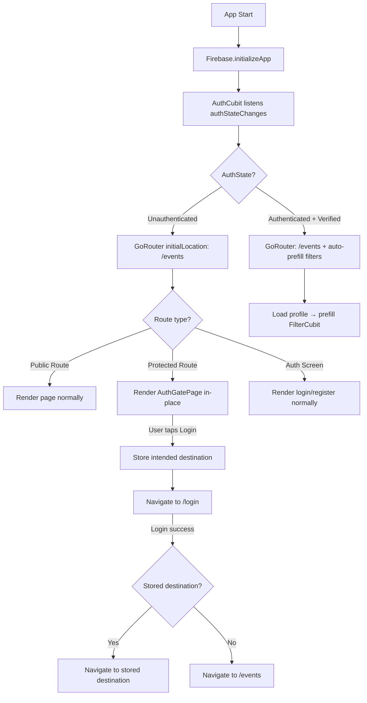
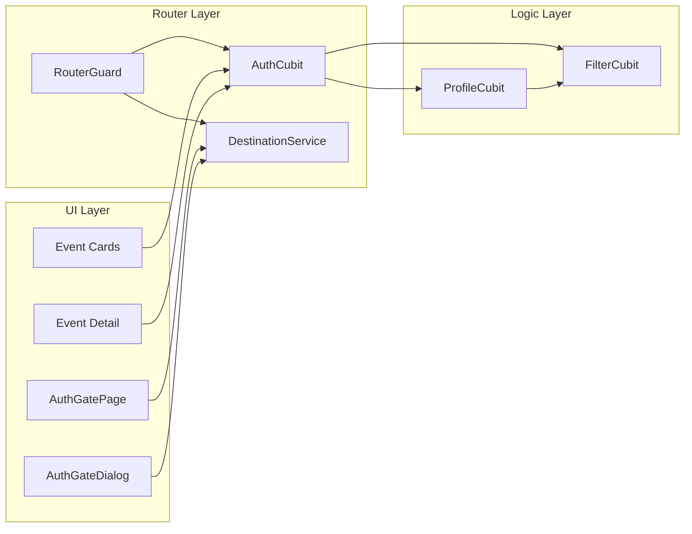

# Design Document: Anonymous Browsing

## Overview

This design enables anonymous (unauthenticated) users to browse public content in the Dancee App — event lists, course lists, and their detail pages — without being forced to sign in. The current `RouterGuard` redirects all unauthenticated users to `/login`; this feature changes it to distinguish between public and protected routes.

The implementation covers four main areas:

1. **Router Guard modification** — Classify routes as public or protected. Anonymous users access public routes freely; protected routes (`/saved`, `/profile`) show an Auth Gate Page instead of redirecting to login.
2. **Auth Gate Page** — A new informational page displayed in place of protected content for anonymous users, with login/register CTAs.
3. **Auth Gate Dialog** — A bottom sheet shown when an anonymous user attempts a protected action (favoriting), explaining the need to sign in.
4. **Filter auto-prefill** — When a user signs in, their profile's `danceTags` and `city` are mapped to filter selections in `FilterCubit`, but only if no filters are currently active.
5. **Return-to-destination flow** — When an anonymous user is shown the auth gate and taps login, the intended destination is stored and restored after successful authentication.

Key design decisions:
- **Auth Gate as in-place page, not redirect** — Instead of redirecting anonymous users to `/login` from protected routes, we render the `AuthGatePage` widget directly within the shell navigation. This preserves the bottom nav context and avoids confusing navigation stack manipulation.
- **Hide favorite button for anonymous users** — Rather than showing the button and then showing a dialog on tap, we hide the favorite button entirely on cards and detail pages for anonymous users (Requirement 1.8). The auth gate dialog (Requirement 3) is kept as a fallback for any future protected actions.
- **Initial route change** — The GoRouter `initialLocation` changes from `/login` to `/events`.
- **No backend changes** — All changes are frontend-only. The existing static Directus access token already supports public data access.

## Architecture

### High-Level Flow



### Component Interaction



### Route Classification

| Route | Type | Anonymous Access |
|-------|------|-----------------|
| `/events` | Public | ✅ Full access |
| `/courses` | Public | ✅ Full access |
| `/events/detail` | Public | ✅ Full access |
| `/courses/detail` | Public | ✅ Full access |
| `/events/filter-dance` | Public | ✅ Full access |
| `/events/filter-location` | Public | ✅ Full access |
| `/saved` | Protected | ❌ Shows AuthGatePage |
| `/profile` | Protected | ❌ Shows AuthGatePage |
| `/profile/*` (sub-routes) | Protected | ❌ Shows AuthGatePage |
| `/login` | Auth | ✅ Full access |
| `/register` | Auth | ✅ Full access |
| `/forgot-password` | Auth | ✅ Full access |
| `/verify-email` | Auth | ✅ (only for unverified users) |
| `/onboarding` | Auth | ✅ (only for new users) |

## Components and Interfaces

### 1. RouterGuard Update

Location: `lib/core/router_guard.dart`

The current guard treats all routes under `/events`, `/courses`, `/profile`, `/saved` as protected. The new guard classifies routes explicitly:

```dart
/// Public routes accessible without authentication.
const _publicPrefixes = ['/events', '/courses'];

/// Protected routes that require authentication.
const _protectedPrefixes = ['/saved', '/profile'];

/// Auth-only screens that authenticated+verified users should leave.
const _authOnlyScreens = ['/login', '/register', '/forgot-password'];

bool _isPublicRoute(String path) =>
    _publicPrefixes.any((prefix) => path.startsWith(prefix));

bool _isProtectedRoute(String path) =>
    _protectedPrefixes.any((prefix) => path.startsWith(prefix));

String? routerGuard(BuildContext context, GoRouterState state) {
  final authState = sl<AuthCubit>().state;
  final location = state.uri.path;

  return authState.map(
    unauthenticated: (_) {
      // Anonymous users can access public routes and auth screens freely.
      // Protected routes are handled in-page (AuthGatePage renders inside shell).
      // No redirect needed — the shell pages check auth state themselves.
      if (location == '/onboarding' || location == '/verify-email') {
        return '/events';
      }
      return null;
    },
    loading: (_) => null,
    authenticated: (s) {
      if (!s.emailVerified) {
        if (location == '/verify-email') return null;
        if (location == '/onboarding') return null;
        return '/verify-email';
      }
      // Verified user — redirect away from auth screens
      if (_authOnlyScreens.contains(location) || location == '/verify-email') {
        // Check for stored destination from auth gate flow
        final destination = sl<DestinationService>().consumeDestination();
        return destination ?? '/events';
      }
      return null;
    },
    error: (_) => null,
  );
}
```

**Key change**: Anonymous users are no longer redirected from protected routes. Instead, the `SavedRoute` and `ProfileRoute` page builders check `AuthCubit` state and render `AuthGatePage` when unauthenticated.

### 2. DestinationService

Location: `lib/services/destination_service.dart`

A simple in-memory service that stores the intended destination when an anonymous user is redirected to login from the auth gate.

```dart
class DestinationService {
  String? _intendedDestination;

  /// Stores the route the user was trying to access.
  void setDestination(String route) {
    _intendedDestination = route;
  }

  /// Returns and clears the stored destination. Returns null if none stored.
  String? consumeDestination() {
    final dest = _intendedDestination;
    _intendedDestination = null;
    return dest;
  }

  /// Whether a destination is currently stored.
  bool get hasDestination => _intendedDestination != null;
}
```

Registered as a lazy singleton in `service_locator.dart`.

### 3. AuthGatePage

Location: `lib/shared/pages/auth_gate_page.dart`

A reusable page widget displayed in place of protected content for anonymous users. It is rendered inside the shell (bottom nav remains visible).

```dart
class AuthGatePage extends StatelessWidget {
  const AuthGatePage({super.key, required this.intendedRoute});

  /// The route the user was trying to access (for return-to-destination).
  final String intendedRoute;

  @override
  Widget build(BuildContext context) {
    // Displays:
    // - Lock icon or illustration
    // - Informational message (t.authGate.message)
    // - "Log in" button → stores intendedRoute, navigates to /login
    // - "Create account" link → stores intendedRoute, navigates to /register
  }
}
```

### 4. AuthGateDialog (Bottom Sheet)

Location: `lib/shared/components/auth_gate_dialog.dart`

A modal bottom sheet shown when an anonymous user attempts a protected action. Used as a fallback mechanism for any future protected actions beyond favorites (since favorites button is hidden for anonymous users per Req 1.8).

```dart
Future<void> showAuthGateDialog(BuildContext context, {String? returnRoute}) {
  return showModalBottomSheet(
    context: context,
    builder: (context) => AuthGateBottomSheet(returnRoute: returnRoute),
  );
}

class AuthGateBottomSheet extends StatelessWidget {
  const AuthGateBottomSheet({super.key, this.returnRoute});

  final String? returnRoute;

  @override
  Widget build(BuildContext context) {
    // Displays:
    // - Icon
    // - Message (t.authGate.actionMessage)
    // - "Log in" button
    // - "Create account" link
  }
}
```

### 5. SavedRoute and ProfileRoute Page Updates

The `SavedRoute` and `ProfileRoute` page builders are updated to check auth state and conditionally render `AuthGatePage`:

```dart
// In SavedRoute
@override
Page<void> buildPage(BuildContext context, GoRouterState state) {
  return NoTransitionPage(
    child: BlocBuilder<AuthCubit, AuthState>(
      builder: (context, authState) {
        return authState.maybeMap(
          authenticated: (_) => const SavedEventsScreen(),
          orElse: () => const AuthGatePage(intendedRoute: '/saved'),
        );
      },
    ),
  );
}
```

Alternatively, the check can be done inside the screen widgets themselves. The approach of wrapping in `BlocBuilder` at the route level keeps the screen widgets clean.

### 6. Favorite Button Visibility

The favorite button on event/course cards and detail pages is conditionally hidden based on auth state.

**Event Detail Screen** (`event_detail_screen.dart`):
```dart
// Wrap HeroFavoriteButton in auth check
final isAuthenticated = context.read<AuthCubit>().state.maybeMap(
  authenticated: (_) => true,
  orElse: () => false,
);

HeroImageSection(
  // ...
  topRight: isAuthenticated
      ? HeroFavoriteButton(
          isFavorite: isFavorited,
          onTap: () => context.read<FavoritesCubit>().toggleFavorite(...),
        )
      : null,
)
```

**FeaturedEventCard** and **UpcomingEventCard**: The `onFavoriteTap` callback is passed as `null` when anonymous, and the card widget hides the button when `onFavoriteTap` is null.

### 7. Filter Auto-Prefill Mechanism

Location: Logic added to `_AppListenersState` in `main.dart`

When `AuthCubit` transitions from `unauthenticated` to `authenticated`, and the profile loads successfully, the app prefills `FilterCubit` if filters are currently empty.

```dart
// New BlocListener in _AppListeners
BlocListener<AuthCubit, AuthState>(
  listenWhen: (prev, curr) =>
      prev.maybeMap(unauthenticated: (_) => true, orElse: () => false) &&
      curr.maybeMap(authenticated: (_) => true, orElse: () => false),
  listener: (context, state) async {
    // Load profile, then prefill filters if empty
    final profileCubit = context.read<ProfileCubit>();
    await profileCubit.loadProfile();
    final filterCubit = context.read<FilterCubit>();
    if (!filterCubit.state.hasActiveFilters) {
      _prefillFiltersFromProfile(profileCubit, filterCubit);
    }
  },
)
```

The prefill logic is extracted as a pure function for testability:

```dart
/// Prefills filter cubit from user profile data.
/// Only called when filterCubit has no active filters.
void prefillFiltersFromProfile(UserProfile profile, FilterCubit filterCubit) {
  // Dance styles
  if (profile.danceTags.isNotEmpty) {
    filterCubit.setDanceStyles(profile.danceTags.toSet());
  }
  // City → Region mapping
  if (profile.city != null && profile.city!.isNotEmpty) {
    final region = mapCityToRegion(profile.city!);
    if (region != null) {
      filterCubit.setLocations({region});
    }
  }
}
```

### 8. City-to-Region Mapping

Location: `lib/shared/utils/city_region_mapper.dart`

Maps a user's city string to the corresponding Czech region code used in the filter system.

```dart
/// Maps a city name to its corresponding region identifier.
/// Returns null if no mapping is found.
String? mapCityToRegion(String city) {
  final normalized = city.trim().toLowerCase();
  for (final entry in _cityRegionMap.entries) {
    if (entry.value.any((c) => normalized.contains(c.toLowerCase()))) {
      return entry.key;
    }
  }
  return null;
}

const _cityRegionMap = <String, List<String>>{
  'prague': ['praha', 'prague'],
  'brno': ['brno'],
  'ostrava': ['ostrava'],
  'plzen': ['plzeň', 'plzen'],
  'liberec': ['liberec'],
  'olomouc': ['olomouc'],
  'ceske-budejovice': ['české budějovice', 'ceske budejovice'],
  'hradec-kralove': ['hradec králové', 'hradec kralove'],
  'pardubice': ['pardubice'],
  'zlin': ['zlín', 'zlin'],
  'jihlava': ['jihlava'],
  'karlovy-vary': ['karlovy vary'],
  'usti-nad-labem': ['ústí nad labem', 'usti nad labem'],
};
```

The region keys match the values used in the existing filter location system (from `FilterLocationScreen`).

### 9. Sign-Out Filter Clear

When the user signs out, `FilterCubit.clearAll()` is called. This is added to the existing `AuthCubit` sign-out listener in `_AppListeners`:

```dart
BlocListener<AuthCubit, AuthState>(
  listenWhen: (prev, curr) =>
      prev.maybeMap(authenticated: (_) => true, orElse: () => false) &&
      curr.maybeMap(unauthenticated: (_) => true, orElse: () => false),
  listener: (context, state) {
    context.read<FilterCubit>().clearAll();
  },
)
```

### 10. Initial Route Change

In `main.dart`, the `_buildRouter` function changes:

```dart
GoRouter _buildRouter(_GoRouterRefreshNotifier authRefreshNotifier) {
  return GoRouter(
    initialLocation: '/events', // Changed from '/login'
    refreshListenable: authRefreshNotifier,
    redirect: routerGuard,
    routes: $appRoutes,
  );
}
```

## Data Models

### No New Data Models

This feature does not introduce new data entities or backend collections. It reuses:
- `AuthState` (freezed) — existing auth state with `unauthenticated`/`authenticated` variants
- `FilterState` (equatable) — existing filter state with `selectedDanceStyles`, `selectedRegions`
- `UserProfile` — existing profile entity with `danceTags` and `city` fields

### DestinationService State

Simple in-memory string storage — no persistence needed. The destination is consumed immediately after login and cleared.

### New i18n Keys

New translation keys added under an `authGate` namespace:

```json
{
  "authGate": {
    "title": "Sign in required",
    "message": "Create an account or sign in to access your saved events and profile.",
    "actionMessage": "You need to sign in to use this feature.",
    "login": "Log in",
    "register": "Create account"
  }
}
```

These are added to all three language files (`strings.i18n.json`, `strings_cs.i18n.json`, `strings_es.i18n.json`).

### Files to Create

| File | Purpose |
|------|---------|
| `lib/services/destination_service.dart` | Stores intended destination for return-after-login |
| `lib/shared/pages/auth_gate_page.dart` | Auth gate page widget |
| `lib/shared/components/auth_gate_dialog.dart` | Auth gate bottom sheet for protected actions |
| `lib/shared/utils/city_region_mapper.dart` | City-to-region mapping for filter prefill |
| `lib/shared/utils/filter_prefill.dart` | Pure function for filter prefill logic |

### Files to Modify

| File | Changes |
|------|---------|
| `lib/core/router_guard.dart` | Rewrite route classification logic, remove redirect for anonymous on public routes |
| `lib/core/service_locator.dart` | Register `DestinationService` |
| `lib/core/app_routes.dart` | Update `SavedRoute` and `ProfileRoute` to conditionally render AuthGatePage |
| `lib/main.dart` | Change `initialLocation` to `/events`, add auth→filter prefill listener, add sign-out→clear filters listener |
| `lib/screens/events/event_detail/event_detail_screen.dart` | Hide favorite button for anonymous users |
| `lib/screens/events/events_list/components/featured_event_card.dart` | Hide favorite button when `onFavoriteTap` is null |
| `lib/screens/events/events_list/components/upcoming_event_card.dart` | Hide favorite button when `onFavoriteTap` is null |
| `lib/screens/courses/course_detail/course_detail_screen.dart` | Hide favorite button for anonymous users |
| `lib/screens/events/events_list/events_list_screen.dart` | Pass null for onFavoriteTap when anonymous |
| `lib/screens/courses/courses_list/courses_list_screen.dart` | Pass null for onFavoriteTap when anonymous |
| `lib/i18n/strings.i18n.json` | Add `authGate` namespace |
| `lib/i18n/strings_cs.i18n.json` | Add `authGate` namespace (Czech) |
| `lib/i18n/strings_es.i18n.json` | Add `authGate` namespace (Spanish) |

## Correctness Properties

*A property is a characteristic or behavior that should hold true across all valid executions of a system — essentially, a formal statement about what the system should do. Properties serve as the bridge between human-readable specifications and machine-verifiable correctness guarantees.*

### Property 1: Router guard redirect correctness for anonymous users

*For any* route path and an `unauthenticated` auth state:
- If the path starts with a public prefix (`/events`, `/courses`), the router guard SHALL return `null` (no redirect)
- If the path is an auth screen (`/login`, `/register`, `/forgot-password`), the router guard SHALL return `null` (no redirect)
- If the path is `/onboarding` or `/verify-email`, the router guard SHALL return `/events` (these require auth)

**Validates: Requirements 1.1, 1.2, 4.1, 4.2, 4.5**

### Property 2: Router guard redirect correctness for authenticated users

*For any* route path and an `authenticated` auth state with `emailVerified = true`:
- If the path is an auth screen (`/login`, `/register`, `/forgot-password`, `/verify-email`), the router guard SHALL return a non-null redirect (to `/events` or stored destination)
- If the path starts with a public prefix (`/events`, `/courses`) or protected prefix (`/saved`, `/profile`), the router guard SHALL return `null` (no redirect)

**Validates: Requirements 2.8, 4.3, 4.6**

### Property 3: Filter auto-prefill from profile

*For any* `UserProfile` with a non-empty `danceTags` list and a non-null `city`, and *for any* empty `FilterState`, calling the prefill function SHALL result in:
- `selectedDanceStyles` equal to the set of `profile.danceTags`
- `selectedRegions` containing the mapped region for `profile.city` (if mapping exists)

*For any* `UserProfile` with empty `danceTags` or null `city`, the corresponding filter field SHALL remain empty after prefill.

**Validates: Requirements 5.1, 5.2, 5.5, 5.6**

### Property 4: Filter auto-prefill does not overwrite existing filters

*For any* `FilterState` where `hasActiveFilters` is `true`, calling the prefill function SHALL return the original state unchanged — no fields are modified.

**Validates: Requirements 5.4**

### Property 5: Return-to-destination round trip

*For any* valid protected route path stored via `DestinationService.setDestination(path)`, calling `consumeDestination()` SHALL return that exact path. After consumption, a subsequent call to `consumeDestination()` SHALL return `null`.

*For any* state where no destination has been stored, `consumeDestination()` SHALL return `null`.

**Validates: Requirements 8.1, 8.2, 8.3, 8.4**

### Property 6: City-to-region mapping determinism

*For any* city string, `mapCityToRegion(city)` SHALL always return the same result for the same input (deterministic). If the city contains a known city name (case-insensitive), it SHALL return the corresponding region key. If no match is found, it SHALL return `null`.

**Validates: Requirements 5.2**

## Error Handling

| Scenario | Handling |
|----------|----------|
| Profile load fails during auto-prefill | Silently skip prefill — filters remain empty. User can manually set filters. No error shown. |
| City-to-region mapping returns null | Leave region filter empty — no error. User can manually select a region. |
| DestinationService has stale destination | Destination is consumed (cleared) on first use. If the route no longer exists, GoRouter's error handling shows the not-found page. |
| Anonymous user deep-links to protected route | AuthGatePage renders in-place within the shell. Bottom nav remains functional. |
| Auth state changes during navigation | GoRouter's `refreshListenable` triggers re-evaluation. The guard handles all transitions correctly. |
| DirectusClient token fallback | When `directusTokenProvider` returns null (anonymous user), the client uses the static `accessToken`. This is existing behavior — no change needed. |
| Filter prefill called with stale profile data | Non-critical — filters are a convenience feature. Stale data is acceptable; user can always adjust manually. |

## Testing Strategy

### Property-Based Testing

Library: `glados` (Dart property-based testing library, already referenced in the firebase-auth spec)

Each correctness property is implemented as a single property-based test with minimum 100 iterations. Tests use random generators for route paths, auth states, filter states, and user profiles.

Tag format: `// Feature: anonymous-browsing, Property N: <title>`

**Property tests to implement:**

| Property | Test Description | Generator |
|----------|-----------------|-----------|
| 1 | Router guard returns null for anonymous + public routes | Random public route paths × unauthenticated state |
| 2 | Router guard returns redirect for authenticated + auth screens | Random auth screen paths × authenticated+verified state |
| 3 | Filter prefill sets correct values from profile | Random UserProfile with varied danceTags/city × empty FilterState |
| 4 | Filter prefill is no-op when filters are active | Random non-empty FilterState × random UserProfile |
| 5 | DestinationService store/consume round trip | Random route path strings |
| 6 | City-to-region mapping determinism | Random city strings (including known cities with varied casing) |

### Unit Tests

Unit tests cover specific examples, edge cases, and widget behavior:

- **RouterGuard**: Test each specific route/state combination from the requirements table
- **AuthGatePage**: Widget test — verify message, login button, register link are present; verify navigation on tap
- **AuthGateDialog**: Widget test — verify bottom sheet content and navigation
- **Favorite button visibility**: Widget test — verify button absent when anonymous, present when authenticated
- **Filter prefill edge cases**: Empty danceTags, null city, whitespace-only city
- **City-to-region mapper**: Known cities (Praha, Brno), unknown cities, empty string, case variations
- **DestinationService**: Store → consume → verify null on second consume
- **Sign-out clears filters**: Verify FilterCubit.clearAll() is triggered on auth state change to unauthenticated
- **Initial route**: Verify GoRouter initialLocation is '/events'
- **Bottom nav for anonymous**: Widget test — all 4 tabs visible, tapping Saved/Profile shows auth gate

### Test File Locations

```
test/
├── core/
│   └── router_guard_test.dart              # Unit + property tests for router guard
├── services/
│   └── destination_service_test.dart       # Unit + property tests for destination service
├── shared/
│   ├── pages/
│   │   └── auth_gate_page_test.dart        # Widget tests
│   ├── components/
│   │   └── auth_gate_dialog_test.dart      # Widget tests
│   └── utils/
│       ├── city_region_mapper_test.dart    # Unit + property tests
│       └── filter_prefill_test.dart        # Unit + property tests
├── screens/
│   ├── events/
│   │   └── event_detail_anonymous_test.dart  # Widget test for hidden favorite
│   └── saved/
│       └── saved_anonymous_test.dart       # Widget test for auth gate rendering
└── properties/
    ├── router_guard_property_test.dart     # Property 1 & 2
    ├── filter_prefill_property_test.dart   # Property 3 & 4
    ├── destination_service_property_test.dart  # Property 5
    └── city_region_mapper_property_test.dart   # Property 6
```
