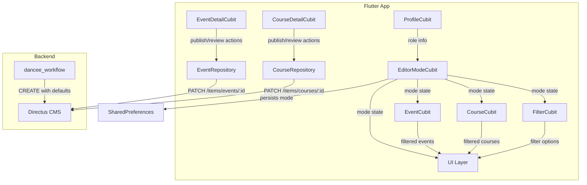

# Design Document: Editor Workflow Features

## Overview

This design adds editorial workflow capabilities to the Dancee App, enabling editors to manage content quality and publication lifecycle. The feature introduces:

- An **EditorModeCubit** that controls whether the app operates in Editor or User mode
- New Directus collection fields (`published`, `reviewed`, `price`, `additional_info`) on events and courses
- A **Dance Style Selector** page for consistent tag editing
- Editor-specific filtering (published/unpublished, reviewed/unreviewed)
- Conditional UI rendering based on mode (status indicators, action buttons, filter options)
- Course visibility rules (future-only for users, all for editors)

The design preserves the existing architecture patterns: Cubit/Bloc state management, Equatable entities, Directus REST API via `DirectusClient`, and `SharedPreferences` for local persistence.

## Architecture



### Key Design Decisions

1. **EditorModeCubit as a singleton** — Registered as a `LazySingleton` in `get_it` so all screens share the same mode state. It depends on `ProfileCubit` to determine if the user has editor permissions.

2. **Client-side filtering for published/reviewed** — In editor mode, the repository fetches ALL items (no `status` filter). Filtering by published/reviewed status happens client-side in the cubits, matching the existing pattern for dance style and region filters.

3. **Server-side filtering for user mode** — In user mode, the existing `filter[status][_eq]=published` query parameter remains, so unpublished items never reach the client.

4. **New fields added to existing entities** — `Event` and `Course` entities gain `published`, `reviewed`, and (for Event) `price` fields. This avoids creating separate editor-specific entity classes.

5. **Dance Style Selector as a standalone page** — Reuses the existing `DanceStyleRepository` and navigates via GoRouter. Returns selected codes via route result.

## Components and Interfaces

### New Components

#### 1. EditorModeCubit (`logic/cubits/editor_mode_cubit.dart`)

```dart
class EditorModeCubit extends Cubit<EditorModeState> {
  EditorModeCubit() : super(const EditorModeState(isEditorMode: false, isEditor: false));

  static const _modeKey = 'editor_mode_enabled';

  /// Initializes from SharedPreferences and user role.
  Future<void> init({required bool isEditor}) async { ... }

  /// Toggles between editor and user mode.
  Future<void> toggleMode() async { ... }

  bool get isEditorMode => state.isEditorMode && state.isEditor;
  bool get isEditor => state.isEditor;
}
```

#### 2. EditorModeState (`logic/states/editor_mode_state.dart`)

```dart
@freezed
class EditorModeState with _$EditorModeState {
  const factory EditorModeState({
    required bool isEditorMode,
    required bool isEditor,
  }) = _EditorModeState;
}
```

#### 3. DanceStyleSelectorPage (`screens/events/dance_style_selector/`)

A full-page multi-select checklist displaying all dance styles from the CMS. Receives the current selection as a route parameter and returns the updated selection on pop.

### Modified Components

#### EventRepository / CourseRepository

New methods:
- `getEventsForEditor(languageCode)` — fetches all items without status filter
- `updatePublishedStatus(id, published)` — PATCH `{published: value}`
- `updateReviewedStatus(id, reviewed)` — PATCH `{reviewed: value}`

#### Event Entity

New fields:
```dart
final bool published;
final bool reviewed;
final String? price; // already exists on Course
```

#### Course Entity

New fields:
```dart
final bool published;
final bool reviewed;
```

#### FilterState

New fields for editor filters:
```dart
final String? publishedFilter;  // 'published', 'unpublished', or null (all)
final String? reviewedFilter;   // 'reviewed', 'unreviewed', or null (all)
```

#### EventCubit / CourseCubit

- Accept `EditorModeCubit` state to determine fetch strategy
- In editor mode: fetch all items, apply client-side published/reviewed filters
- In user mode: fetch only published items (existing behavior)
- CourseCubit additionally filters by start_date >= today in user mode

#### FilterCubit

- New methods: `setPublishedFilter(String?)`, `setReviewedFilter(String?)`
- These filters are only active when `EditorModeCubit.isEditorMode` is true

### Interface Contracts

```dart
// EditorModeCubit public API
abstract class IEditorMode {
  bool get isEditorMode;
  bool get isEditor;
  Future<void> toggleMode();
  Future<void> init({required bool isEditor});
}

// Repository additions
abstract class IEventRepository {
  Future<List<Event>> getEventsForEditor(String languageCode);
  Future<void> updatePublishedStatus(int id, bool published);
  Future<void> updateReviewedStatus(int id, bool reviewed);
}

abstract class ICourseRepository {
  Future<List<Course>> getCoursesForEditor(String languageCode);
  Future<void> updatePublishedStatus(int id, bool published);
  Future<void> updateReviewedStatus(int id, bool reviewed);
}
```

## Data Models

### Directus Collection Changes

#### `events` collection — new fields

| Field | Type | Default | Description |
|-------|------|---------|-------------|
| `published` | boolean | `true` | Whether the event is visible to regular users |
| `reviewed` | boolean | `false` | Whether an editor has reviewed the event |
| `price` | string (nullable) | `null` | Price with currency, e.g. "500 CZK" |
| `additional_info` | JSON array (nullable) | `[]` | Array of `{key, value}` objects |

#### `courses` collection — new fields

| Field | Type | Default | Description |
|-------|------|---------|-------------|
| `published` | boolean | `true` | Whether the course is visible to regular users |
| `reviewed` | boolean | `false` | Whether an editor has reviewed the course |

Note: `price` already exists on courses. `additional_info` is event-specific.

### Flutter Entity Changes

#### Event (updated)

```dart
class Event extends Equatable {
  // ... existing fields ...
  final bool published;
  final bool reviewed;
  final String? price;         // new field for event price
  final List<EventInfo> info;  // existing — used for additional_info
}
```

#### Course (updated)

```dart
class Course extends Equatable {
  // ... existing fields ...
  final bool published;
  final bool reviewed;
}
```

### Directus Schema Updates (Zod)

```typescript
// In schemas.ts — DirectusEventSchema additions
published: z.boolean().default(true),
reviewed: z.boolean().default(false),
price: z.string().nullable().optional(),
additional_info: z.array(z.object({
  key: z.string(),
  value: z.string(),
})).nullable().optional(),

// In schemas.ts — DirectusCourseSchema additions
published: z.boolean().default(true),
reviewed: z.boolean().default(false),
```

### Workflow Service Changes

In `workflow.ts`, the `newEvent` object gains:
```typescript
published: true,   // scraped events are published by default
reviewed: false,   // scraped events are unreviewed by default
```

Similarly for `newCourse`.

### API Query Changes

#### User mode (existing behavior, unchanged)
```
GET /items/events?filter[status][_eq]=published&filter[published][_eq]=true&filter[start_time][_gte]=$NOW
```

#### Editor mode (new)
```
GET /items/events?fields=*,venue.*,translations.*&sort=start_time&limit=-1
```
No status or published filter — returns all items.

## Correctness Properties

*A property is a characteristic or behavior that should hold true across all valid executions of a system — essentially, a formal statement about what the system should do. Properties serve as the bridge between human-readable specifications and machine-verifiable correctness guarantees.*

### Property 1: Mode-dependent control visibility

*For any* app state, if `isEditorMode` is true and the user has editor role, then editor-specific controls (reviewed checkbox, publish/unpublish button, editor filters) SHALL be rendered. If `isEditorMode` is false, those controls SHALL NOT be rendered regardless of user role.

**Validates: Requirements 4.2, 4.3, 5.1, 5.5, 10.1, 10.2**

### Property 2: Mode persistence round-trip

*For any* boolean mode value, persisting it to SharedPreferences and then reading it back SHALL return the same value.

**Validates: Requirements 4.4**

### Property 3: Visibility filtering by mode

*For any* list of items with mixed published/unpublished status, filtering in user mode SHALL return only items where `published == true`. Filtering in editor mode SHALL return all items regardless of published status.

**Validates: Requirements 6.4, 6.5, 10.3**

### Property 4: Publish/unpublish toggle

*For any* item with a given published status, calling the publish toggle SHALL produce a PATCH payload with the opposite boolean value and update the local state accordingly.

**Validates: Requirements 6.2, 6.3**

### Property 5: Reviewed status toggle

*For any* item with a given reviewed status, calling the review toggle SHALL flip the boolean and produce a PATCH payload containing the new value.

**Validates: Requirements 5.4**

### Property 6: Editor filter correctness

*For any* list of items with mixed published and reviewed statuses, and *for any* combination of publishedFilter and reviewedFilter values, the filtered result SHALL contain exactly those items matching ALL active filter criteria simultaneously.

**Validates: Requirements 7.2, 7.3, 7.4, 7.5, 7.6**

### Property 7: Course date filtering by mode

*For any* list of courses with various start dates and a given reference date (today), filtering in user mode SHALL return only courses where `startDate >= today`. Filtering in editor mode SHALL return all courses regardless of start date.

**Validates: Requirements 9.1, 9.3**

### Property 8: Default statuses for workflow-created items

*For any* event or course created by the workflow service, the resulting record SHALL have `published == true` and `reviewed == false`.

**Validates: Requirements 8.1**

### Property 9: Default statuses for user-submitted items

*For any* event created via the app's add event flow, the payload SHALL include `published == false` and `reviewed == false`.

**Validates: Requirements 8.2**

### Property 10: Dance style selection state consistency

*For any* list of dance styles and *for any* subset of selected style codes, the Dance Style Selector SHALL render each style with a checkbox whose checked state matches whether its code is in the selected set.

**Validates: Requirements 1.2**

### Property 11: Item card icon rendering by mode

*For any* item rendered in a list view, if the app is in editor mode the card SHALL display a checkbox icon (not heart), and if in user mode the card SHALL display a heart/favorite icon (not checkbox), regardless of the item's reviewed status.

**Validates: Requirements 5.1, 5.5, 10.4**

### Property 12: Reviewed checkbox state matches data

*For any* item with `reviewed == true`, the checkbox icon SHALL appear checked. For `reviewed == false`, it SHALL appear unchecked.

**Validates: Requirements 5.2**

### Property 13: New items default to unreviewed

*For any* newly created item (event or course), the `reviewed` field SHALL be `false`.

**Validates: Requirements 5.6**

### Property 14: Info entry removal correctness

*For any* non-empty list of info entries and *for any* valid index, removing the entry at that index SHALL produce a list of length `n - 1` that does not contain the removed entry.

**Validates: Requirements 3.3**

### Property 15: Price display in detail view

*For any* event with a non-null price string, the event detail view SHALL include that price string in its rendered output.

**Validates: Requirements 2.4**

## Error Handling

### Network Errors

- **PATCH failures** (publish/review/save): Show a snackbar with the error message. The UI reverts to the previous state (optimistic updates are NOT used for editorial actions to avoid inconsistency).
- **Fetch failures in editor mode**: Same error handling as existing user mode — emit `EventState.error` / `CourseState.error` with the appropriate translation key.

### Permission Errors

- **403 Forbidden**: If a non-editor user somehow triggers an editor action (e.g., via deep link), the repository call will fail with 403. The cubit emits an error state with `api.errors.forbidden`.
- **Role mismatch**: If `UserProfile.role` changes (e.g., editor permissions revoked), `EditorModeCubit` should re-evaluate on profile reload and force switch to user mode.

### Data Consistency

- **Stale data after toggle**: After a successful publish/review toggle, the detail cubit re-fetches the item to ensure the displayed data matches the server state.
- **Concurrent edits**: No optimistic locking. Last write wins (acceptable for a single-editor workflow).

### Edge Cases

- **No profile loaded yet**: `EditorModeCubit` defaults to `isEditor: false` until the profile is loaded. The mode toggle is hidden.
- **Null start_date on courses**: Courses without a start_date are treated as "future" (shown in user mode) to avoid hiding content unnecessarily.

## Testing Strategy

### Property-Based Tests (fast-check)

The project uses **fast-check** for property-based testing in the TypeScript backend (vitest + fast-check). For the Flutter frontend, **glados** (Dart PBT library) will be used.

Each property test runs a minimum of 100 iterations and is tagged with its design property reference.

**Backend (TypeScript/Vitest + fast-check):**
- Property 3: Visibility filtering logic (pure function)
- Property 4: Publish toggle payload generation
- Property 5: Review toggle payload generation
- Property 6: Editor filter combination logic (pure function)
- Property 7: Course date filtering logic (pure function)
- Property 8: Workflow default values
- Property 14: Info entry removal logic

**Frontend (Dart/Glados):**
- Property 2: Mode persistence round-trip
- Property 10: Dance style selection state
- Property 12: Checkbox state matches reviewed data

### Unit Tests (example-based)

- EditorModeCubit: init with editor role, init without editor role, toggle behavior
- EventRepository: `getEventsForEditor` query parameters, `updatePublishedStatus` PATCH payload
- CourseRepository: `getCoursesForEditor` query parameters, `updateReviewedStatus` PATCH payload
- Event/Course entity: `fromDirectus` parsing of new fields with various JSON shapes
- FilterState: `copyWith` for new filter fields
- DanceStyleSelectorPage: navigation and result passing

### Widget Tests

- Mode toggle visibility based on role
- Editor controls visibility in editor vs user mode
- Publish/unpublish button state and interaction
- Reviewed checkbox rendering and tap handling
- Filter panel with editor-specific options
- Dance Style Selector page checkbox interactions
- Price field on edit event screen
- Additional info entries display and editing

### Integration Tests

- Full publish/unpublish flow: toggle → API call → re-fetch → UI update
- Full review toggle flow: tap → API call → re-fetch → UI update
- Mode switch: toggle mode → list reloads with correct filtering
- Dance style edit: navigate to selector → select styles → save → verify persistence

### Test Configuration

- Property tests: minimum 100 iterations per property
- Tag format: `Feature: editor-workflow-features, Property {N}: {description}`
- Backend tests in `backend/dancee_workflow/src/__tests__/`
- Frontend tests in `frontend/dancee_app/test/`
