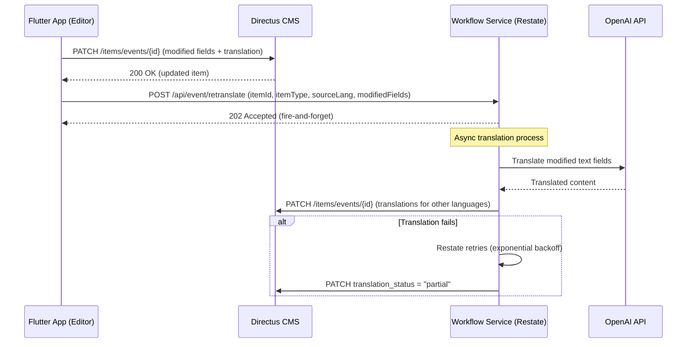
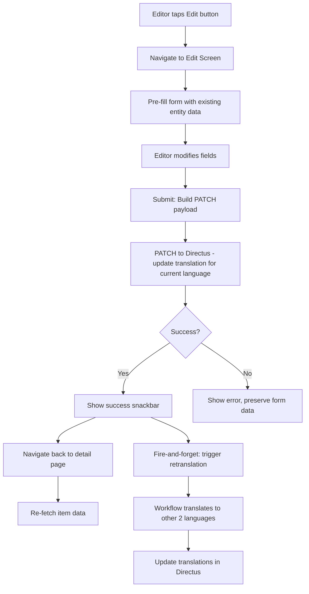

# Design Document: Event/Course Editing

## Overview

This feature adds inline editing capabilities for events and courses, accessible to users with the "Editor" Directus role. The architecture spans three layers:

1. **Flutter App** — Detects editor role, shows edit button on detail pages, reuses existing add forms in edit mode, sends PATCH requests to Directus
2. **Directus CMS** — Receives PATCH updates to event/course items and their translations
3. **Workflow Service (Restate)** — Handles asynchronous re-translation of modified text fields to the other two languages after an edit

The key design decision is to reuse the existing add event/course form widgets by parameterizing them with an optional initial data object and an `isEditMode` flag, rather than creating separate edit screens.

## Architecture



### High-Level Data Flow



## Components and Interfaces

### Flutter App Components

#### 1. Editor Role Detection

**UserProfile entity** — Add `role` field (nullable String):
```dart
class UserProfile extends Equatable {
  // ... existing fields ...
  final String? role;
}
```

**AppConfig** — Add editor role ID constant:
```dart
static const String editorRoleId = sensitive.editorRoleId;
```

**ProfileCubit** — Add `isEditor` computed getter:
```dart
bool get isEditor {
  final profile = state.maybeMap(
    loaded: (s) => s.profile,
    orElse: () => null,
  );
  if (profile == null) return false;
  return profile.role == AppConfig.editorRoleId;
}
```

#### 2. Routing (go_router_builder)

New type-safe routes:
```dart
@TypedGoRoute<EditEventRoute>(path: '/events/edit')
class EditEventRoute extends GoRouteData {
  const EditEventRoute({required this.id});
  final int id;
  // Builds EditEventScreen with BlocProvider for EventDetailCubit
}

@TypedGoRoute<EditCourseRoute>(path: '/courses/edit')
class EditCourseRoute extends GoRouteData {
  const EditCourseRoute({required this.id});
  final int id;
  // Builds EditCourseScreen with BlocProvider for CourseDetailCubit
}
```

Route guard: The `routerGuard` function is extended to redirect non-editor users from `/events/edit` and `/courses/edit` paths to the corresponding detail page.

#### 3. Edit Screens

**EditEventScreen** — Wraps the existing add event form sections with:
- A header showing "Edit event" (localized)
- Form sections pre-filled via an `EditEventCubit`
- A submit button showing "Save changes" (localized)

**EditCourseScreen** — Same pattern for courses.

The form sections are reused by making them read their initial values from a cubit that provides either empty defaults (add mode) or pre-filled data (edit mode). The sections already use stateless widgets with no internal state management, so they can be driven by a cubit.

#### 4. Detail & Edit Cubits (State Management)

Currently, `EventDetailScreen` reads event data from the global `EventCubit` list, which breaks when the user navigates directly to a detail URL (deep link / cold start) because the list hasn't been loaded yet. This feature introduces dedicated detail cubits that also handle the edit lifecycle.

**EventDetailCubit** — Manages both detail viewing and editing:
```dart
// States (freezed):
// - loading: fetching event data by ID
// - loaded: event data available for display
// - editing: form is populated, user can edit (same event data, edit mode flag)
// - submitting: PATCH in progress
// - success: update completed successfully
// - error: load or update failed

class EventDetailCubit extends Cubit<EventDetailState> {
  EventDetailCubit({required EventRepository eventRepository});

  /// Loads a single event by ID.
  /// 1. Checks global EventCubit cache first (instant, no network)
  /// 2. Falls back to fetching from Directus API: GET /items/events/{id}?fields=*,translations.*,venue.*
  Future<void> loadEvent(int eventId, String languageCode);

  /// Transitions to editing state (same data, enables form mode)
  void startEditing();

  /// Submits modified fields via PATCH, triggers retranslation on success
  Future<void> submitEdit(int eventId, Map<String, dynamic> modifiedFields, String languageCode);

  /// Re-fetches event data after successful edit (refreshes detail view)
  Future<void> refreshEvent(int eventId, String languageCode);
}
```

**CourseDetailCubit** — Same pattern for courses:
```dart
class CourseDetailCubit extends Cubit<CourseDetailState> {
  CourseDetailCubit({required CourseRepository courseRepository});

  Future<void> loadCourse(int courseId, String languageCode);
  void startEditing();
  Future<void> submitEdit(int courseId, Map<String, dynamic> modifiedFields, String languageCode);
  Future<void> refreshCourse(int courseId, String languageCode);
}
```

**Key design decisions:**
- The detail cubit is scoped per-screen (provided via `BlocProvider` in the route builder), not global
- `loadEvent` first tries to find the event in the global `EventCubit` state (cache hit = no network call), then falls back to a direct API fetch (supports deep links / cold start)
- The same cubit handles both viewing and editing — no separate `EditEventCubit` needed
- After successful edit, `refreshEvent` re-fetches from API to ensure the detail page shows the latest data
- The global `EventCubit` list is also invalidated (re-loaded) after a successful edit so the list page stays in sync

#### 5. Repository Methods

**EventRepository** — Add methods for single-event fetch and update:
```dart
/// Fetches a single event by ID (for deep link / cold start support)
Future<Event> getEventById(int id, String languageCode);

/// Updates event translation fields via PATCH
Future<void> updateEvent(int id, Map<String, dynamic> fields, String languageCode);

/// Triggers retranslation on the workflow service (fire-and-forget)
Future<void> triggerRetranslation(int id, String itemType, String sourceLang, Map<String, String> modifiedTextFields);
```

**CourseRepository** — Add equivalent methods:
```dart
Future<Course> getCourseById(int id, String languageCode);
Future<void> updateCourse(int id, Map<String, dynamic> fields, String languageCode);
Future<void> triggerRetranslation(int id, String itemType, String sourceLang, Map<String, String> modifiedTextFields);
```

Both repositories:
1. `getById` fetches from `/items/{collection}/{id}?fields=*,translations.*,venue.*` with language filter
2. `update` builds the PATCH payload with the translation nested under the correct language code
3. `triggerRetranslation` POSTs to the workflow service endpoint (fire-and-forget, errors are swallowed)

#### 6. DetailHeaderSection Enhancement

The `DetailHeaderSection` widget already accepts an `actions` parameter. The event/course detail screens will conditionally pass an edit button action when the user is an editor:

```dart
DetailHeaderSection(
  title: t.events.detail.header,
  onBack: () => context.pop(),
  actions: profileCubit.isEditor
    ? [EditIconButton(onTap: () => EditEventRoute(id: event.id).go(context))]
    : null,
)
```

### Backend Components (Workflow Service)

#### 7. Retranslation API Handler

New handler in `ApiService`:
```typescript
retranslateItem: async (ctx: restate.Context, request: {
  itemId: number;
  itemType: "event" | "course";
  sourceLang: string;
  modifiedTextFields: Record<string, string>;
}) => { ... }
```

This handler:
1. Validates the request
2. Determines target languages (all 3 minus sourceLang)
3. Calls `translateEventContent` or `translateCourseContent` for each target language
4. PATCHes the translations back to Directus
5. Updates `translation_status` based on success/failure
6. Relies on Restate's built-in retry for transient failures

#### 8. HTTP Proxy Route

New route mapping in `index.ts`:
```typescript
"/api/event/retranslate": "/ApiService/retranslateItem",
```

### API Contracts

#### PATCH Event Translation (Flutter → Directus)

The PATCH payload includes both root-level (non-translatable) fields and nested translation fields. Root-level fields are sent directly on the event object; translatable text fields are nested under the `translations` array.

```
PATCH /items/events/{id}
Authorization: Bearer <directus-session-token>
Content-Type: application/json

{
  "start_time": "2026-06-15T20:00:00",
  "end_time": "2026-06-15T23:00:00",
  "dances": ["salsa", "bachata"],
  "event_type": "social",
  "venue": 42,
  "translations": [
    {
      "id": <existing_translation_id>,
      "languages_code": "cs",
      "title": "Updated title",
      "description": "Updated description",
      "parts_translations": [...],
      "info_translations": [...]
    }
  ]
}
```

Response: `200 OK` with updated event object.

Root-level editable fields (non-translatable): `start_time`, `end_time`, `dances` (array of style codes), `event_type`, `venue` (FK to venues), `organizer`, `organizer_email`, `original_url`, `registration_url`.

Translation-level editable fields (translatable): `title`, `description`, `parts_translations`, `info_translations`.

#### PATCH Course Translation (Flutter → Directus)

```
PATCH /items/courses/{id}
Authorization: Bearer <directus-session-token>
Content-Type: application/json

{
  "start_date": "2026-09-01",
  "end_date": "2026-12-15",
  "dance_type": "salsa",
  "level": "beginner",
  "venue": 42,
  "lesson_count": 12,
  "lesson_duration": 60,
  "max_participants": 20,
  "price": 3500,
  "schedule_day": "monday",
  "schedule_time": "19:00",
  "translations": [
    {
      "id": <existing_translation_id>,
      "languages_code": "en",
      "title": "Updated title",
      "description": "Updated description",
      "learning_items": ["item1", "item2"]
    }
  ]
}
```

Root-level editable fields (non-translatable): `start_date`, `end_date`, `dance_type`, `level`, `venue` (FK), `lesson_count`, `lesson_duration`, `max_participants`, `price`, `schedule_day`, `schedule_time`, `original_url`, `registration_url`, `instructor_name`.

Translation-level editable fields (translatable): `title`, `description`, `learning_items`, `price_note`, `instructor_bio`.

#### Trigger Retranslation (Flutter → Workflow Service)

```
POST /api/event/retranslate
Content-Type: application/json

{
  "itemId": 42,
  "itemType": "event",
  "sourceLang": "cs",
  "modifiedTextFields": {
    "title": "Nový název",
    "description": "Nový popis"
  }
}
```

Response: `202 Accepted` (or Restate's standard response).

The workflow service then:
1. Fetches the full item from Directus (to get parts/info for events)
2. Translates modified text fields to the other 2 languages
3. PATCHes translations back to Directus
4. Sets `translation_status` to "complete" or "partial"

## Data Models

### Modified Entities

**UserProfile** (Flutter):
```dart
class UserProfile extends Equatable {
  // Add:
  final String? role;  // Directus role UUID
}
```

**EventDetailState** (Flutter, freezed):
```dart
@freezed
class EventDetailState with _$EventDetailState {
  const factory EventDetailState.loading() = _Loading;
  const factory EventDetailState.loaded({
    required Event event,
    required int? translationId,  // ID of the translation record for current language
  }) = _Loaded;
  const factory EventDetailState.editing({
    required Event event,
    required int? translationId,
  }) = _Editing;
  const factory EventDetailState.submitting({required Event event}) = _Submitting;
  const factory EventDetailState.success({required Event event}) = _Success;
  const factory EventDetailState.error({
    Event? event,  // preserved for edit form recovery
    required String message,
  }) = _Error;
}
```

**CourseDetailState** (Flutter, freezed):
```dart
@freezed
class CourseDetailState with _$CourseDetailState {
  const factory CourseDetailState.loading() = _Loading;
  const factory CourseDetailState.loaded({
    required Course course,
    required int? translationId,
  }) = _Loaded;
  const factory CourseDetailState.editing({
    required Course course,
    required int? translationId,
  }) = _Editing;
  const factory CourseDetailState.submitting({required Course course}) = _Submitting;
  const factory CourseDetailState.success({required Course course}) = _Success;
  const factory CourseDetailState.error({
    Course? course,
    required String message,
  }) = _Error;
}
```

### Retranslation Request Schema (Backend)

```typescript
const RetranslateRequestSchema = z.object({
  itemId: z.number(),
  itemType: z.enum(["event", "course"]),
  sourceLang: z.enum(["cs", "en", "es"]),
  modifiedTextFields: z.record(z.string()),
});
```

### Translation Status Values

The `translation_status` field on events/courses uses these values:
- `"complete"` — all 3 languages have translations
- `"partial"` — 1-2 languages have translations (some failed)
- `"missing"` — no translations exist

## Correctness Properties

*A property is a characteristic or behavior that should hold true across all valid executions of a system — essentially, a formal statement about what the system should do. Properties serve as the bridge between human-readable specifications and machine-verifiable correctness guarantees.*

### Property 1: PATCH Payload Construction

*For any* item type (event or course), any item ID, and any set of modified fields, the constructed PATCH payload SHALL contain exactly the modified fields nested under the correct translation record with the appropriate `languages_code`, and SHALL target the endpoint `/items/{collection}/{id}`.

**Validates: Requirements 6.1, 6.2, 10.1**

### Property 2: Translation Field Filtering

*For any* set of field modifications containing a mix of text fields (title, description, parts_translations, info_translations, learning_items) and non-text fields (dates, URLs, coordinates, numeric values), the retranslation request SHALL include only the text fields in `modifiedTextFields`.

**Validates: Requirements 10.4**

### Property 3: Translation Status Computation

*For any* set of language codes representing completed translations (subset of {cs, en, es}), the computed `translation_status` SHALL be "complete" if all 3 are present, "partial" if 1-2 are present, and "missing" if none are present.

**Validates: Requirements 10.8**

## Error Handling

### Flutter App Errors

| Error Scenario | Handling |
|---|---|
| Network timeout on PATCH | Show error snackbar, preserve form data, allow retry |
| 401 Unauthorized | Trigger token refresh via DirectusClient interceptor, retry once |
| 403 Forbidden | Show "insufficient permissions" error, stay on form |
| 404 Not Found | Show "item no longer exists" error, navigate back to list |
| 500 Server Error | Show generic error, preserve form data |
| Validation error (empty required fields) | Client-side validation before submission |

### Workflow Service Errors

| Error Scenario | Handling |
|---|---|
| OpenAI translation fails | Restate retries with exponential backoff |
| Directus PATCH fails (translation update) | Restate retries; on terminal failure, set `translation_status = "partial"` |
| Invalid request (missing fields) | Return 400 TerminalError (no retry) |
| Item not found in Directus | Return 404 TerminalError (no retry) |
| All retries exhausted | Log error, set `translation_status = "partial"`, do NOT revert original edit |

### Key Error Handling Principles

1. **Original edit is never reverted** — Translation failures are independent of the editor's save
2. **Fire-and-forget from app perspective** — The app shows success as soon as the PATCH to Directus succeeds
3. **Restate durability** — Translation retries are handled by Restate's built-in mechanism
4. **Partial state is visible** — `translation_status = "partial"` makes incomplete translations visible in the Directus admin UI

## Testing Strategy

### Unit Tests (Flutter)

- `UserProfile.fromDirectus` correctly parses `role` field
- `ProfileCubit.isEditor` returns correct value for editor/non-editor/unauthenticated states
- `EventDetailCubit` state transitions: loading → loaded (cache hit), loading → loaded (API fetch), loaded → editing → submitting → success/error
- `EventDetailCubit.loadEvent` falls back to API when event not in global cache (deep link support)
- `CourseDetailCubit` state transitions (same pattern)
- PATCH payload construction (event and course)
- Translation field filtering (text vs non-text fields)
- Route guard redirects non-editors away from edit routes

### Widget Tests (Flutter)

- Edit button appears for editor users on event detail page
- Edit button appears for editor users on course detail page
- Three-dots button appears for non-editor/anonymous users
- Form pre-fills correctly with event/course data
- Submit button shows "Save changes" text in edit mode
- Loading indicator appears during submission
- Success snackbar appears after successful update
- Error message appears on failure with form data preserved

### Unit Tests (Backend)

- `retranslateItem` handler validates request schema
- `retranslateItem` correctly identifies target languages (excludes source)
- Translation status computation (property-based test)
- Modified text field extraction logic

### Integration Tests

- Full edit flow: PATCH to Directus → trigger retranslation → verify translations updated
- Retranslation failure: verify original edit persists, status set to "partial"

### Property-Based Tests

Property-based testing is applicable to this feature for the pure logic functions:

- **Library**: `fast-check` (TypeScript, backend) / `glados` (Dart, frontend)
- **Minimum iterations**: 100 per property
- **Tag format**: `Feature: event-course-editing, Property {N}: {description}`

Properties to test:
1. PATCH payload construction correctness
2. Text field filtering (only translatable fields passed to translation)
3. Translation status computation (`computeTranslationStatus`)
