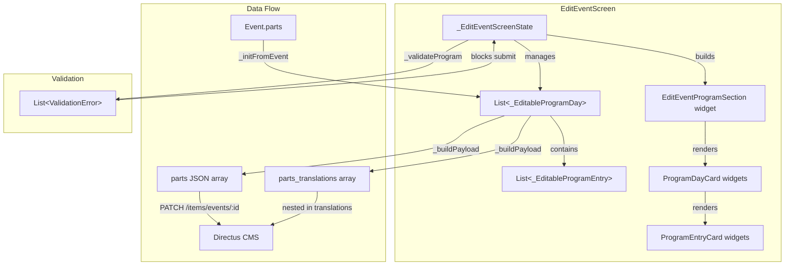

# Design Document: Event Program Editing

## Overview

This design adds a program (schedule/timetable) editing section to the existing `EditEventScreen`. The feature enables editors to manage the multi-day event program directly — adding/removing days, adding/removing time slots within each day, and editing all fields of each entry (name, description, type, times, lectors, DJs).

The implementation follows the same architectural patterns as the existing edit event screen:
- Stateful widget with `TextEditingController`-based form state
- Diff-based payload construction (only changed fields are sent)
- PATCH to Directus CMS via `EventRepository.updateEvent`
- Retranslation trigger for modified text fields

The UI mirrors the existing `AddEventProgramSection` pattern: day cards containing entry cards, with "Add Day" at section level and "Add Entry" within each day card.

## Architecture



### Key Design Decisions

1. **Inline editing within EditEventScreen** — The program section is added as another section in the existing `_buildForm` method, consistent with how other sections (basic info, dates, dance styles, additional info) are structured. No separate screen or cubit needed.

2. **Stateful form model with TextEditingControllers** — Each editable field uses a `TextEditingController`, matching the existing pattern in `EditEventScreen` for title, description, organizer, etc. This avoids introducing a new state management pattern.

3. **Day grouping derived from date** — When loading existing parts, entries are grouped by the date component of `date_time_range.start`. Entries without a start date go into a special "ungrouped" section. This matches the backend's storage model where day grouping is implicit.

4. **Diff-based payload** — The `parts` field is only included in the PATCH payload if the program has actually changed compared to the original event data. This follows the existing pattern used for `info`, `dances`, and other fields.

5. **Comma-separated lectors/DJs input** — Lectors and DJs are stored as `string[]` in the backend but edited as comma-separated text fields in the UI. This is simpler than a tag-input widget and matches the data's nature (short lists of names).

## Components and Interfaces

### New Components

#### 1. EditEventProgramSection (widget extracted from EditEventScreen)

A stateless widget that receives the program state and callbacks, rendering the full program section UI. Extracted for readability but lives in the same file or a sibling file.

```dart
class EditEventProgramSection extends StatelessWidget {
  const EditEventProgramSection({
    super.key,
    required this.programDays,
    required this.ungroupedEntries,
    required this.onAddDay,
    required this.onRemoveDay,
    required this.onAddEntry,
    required this.onRemoveEntry,
    required this.onDayDateChanged,
    required this.onStateChanged,
    required this.validationErrors,
  });
  // ...
}
```

#### 2. _EditableProgramDay (form model)

```dart
class _EditableProgramDay {
  final int id;
  DateTime? date;
  final List<_EditableProgramEntry> entries;

  _EditableProgramDay({required this.id, this.date, List<_EditableProgramEntry>? entries})
      : entries = entries ?? [];

  void dispose() { /* dispose all entry controllers */ }
}
```

#### 3. _EditableProgramEntry (form model)

```dart
class _EditableProgramEntry {
  final int id;
  final TextEditingController nameController;
  final TextEditingController descriptionController;
  String type; // 'party' | 'workshop' | 'openLesson'
  TimeOfDay? startTime;
  TimeOfDay? endTime;
  final TextEditingController lectorsController; // comma-separated
  final TextEditingController djsController;     // comma-separated

  _EditableProgramEntry({
    required this.id,
    String name = '',
    String? description,
    this.type = 'workshop',
    this.startTime,
    this.endTime,
    String lectors = '',
    String djs = '',
  }) : nameController = TextEditingController(text: name),
       descriptionController = TextEditingController(text: description ?? ''),
       lectorsController = TextEditingController(text: lectors),
       djsController = TextEditingController(text: djs);

  void dispose() { /* dispose all controllers */ }
}
```

### Modified Components

#### EditEventScreen (`_EditEventScreenState`)

New state fields:
```dart
List<_EditableProgramDay> _programDays = [];
List<_EditableProgramEntry> _ungroupedEntries = [];
int _dayIdCounter = 0;
int _entryIdCounter = 0;
List<EventPart>? _originalParts; // for diff comparison
```

New methods:
- `_initProgramFromEvent(Event event)` — groups existing parts by date into `_EditableProgramDay` instances
- `_addProgramDay()` — appends a new empty day
- `_removeProgramDay(int dayId)` — removes a day and its entries
- `_addProgramEntry(int dayId)` — appends a new entry to a day
- `_removeProgramEntry(int dayId, int entryId)` — removes an entry
- `_buildPartsPayload()` — serializes to EventPart JSON array
- `_buildPartsTranslationsPayload()` — serializes name/description for translation
- `_programHasChanged()` — compares current state to original
- `_validateProgram()` — returns list of validation errors

The existing `_buildPayload` method is extended to include `parts` and `parts_translations` when the program has changed.

#### EventPart entity

No changes needed. The existing `EventPart.fromDirectus` handles deserialization. Serialization (Dart → JSON) is handled by the `_buildPartsPayload` method in the screen.

## Data Models

### Editable Form State (in-memory, not persisted)

```
_EditableProgramDay
├── id: int (local counter, not persisted)
├── date: DateTime? (the day's date)
└── entries: List<_EditableProgramEntry>
    ├── id: int (local counter)
    ├── nameController: TextEditingController
    ├── descriptionController: TextEditingController
    ├── type: String ('party' | 'workshop' | 'openLesson')
    ├── startTime: TimeOfDay?
    ├── endTime: TimeOfDay?
    ├── lectorsController: TextEditingController (comma-separated)
    └── djsController: TextEditingController (comma-separated)
```

### Serialization: Form State → EventPart JSON

Each `_EditableProgramEntry` within a `_EditableProgramDay` serializes to:

```json
{
  "name": "Workshop: Bachata Sensual",
  "description": "Intermediate level workshop",
  "type": "workshop",
  "dances": [],
  "date_time_range": {
    "start": "2025-03-15T14:00:00.000",
    "end": "2025-03-15T15:30:00.000"
  },
  "lectors": ["John Doe", "Jane Smith"],
  "djs": ["DJ Mike"]
}
```

Rules:
- `date_time_range.start` combines the day's date with the entry's start time. If no start time, uses midnight of the day's date (to preserve day grouping).
- `date_time_range.end` combines the day's date with the entry's end time. If no end time, set to `null`.
- `lectors` and `djs` are split from comma-separated string, trimmed, and empty strings filtered out.
- `dances` is always an empty array (dance styles are managed at the event level, not per-part).
- Ungrouped entries (no day date) have `date_time_range.start` and `date_time_range.end` set to `null`.

### Deserialization: EventPart → Form State

When loading an event:
1. Read `event.parts` (already parsed as `List<EventPart>`)
2. Group by date component of `startTime`:
   - Parts with `startTime != null` → grouped by `startTime` date (year/month/day)
   - Parts with `startTime == null` → placed in ungrouped list
3. Sort groups chronologically by date
4. Within each group, sort entries by `startTime` (nulls at end)
5. Create `_EditableProgramDay` for each group with the shared date
6. Create `_EditableProgramEntry` for each part, extracting time components

### Translation Payload

When program changes are saved, the translation payload includes:

```json
{
  "translations": [{
    "id": 123,
    "languages_code": "cs",
    "title": "...",
    "description": "...",
    "parts_translations": [
      {"name": "Workshop: Bachata Sensual", "description": "Intermediate level"},
      {"name": "Party: Latin Night", "description": ""}
    ]
  }]
}
```

The `parts_translations` array is positionally aligned with the `parts` array — index 0 of `parts_translations` corresponds to index 0 of `parts`.

### Diff Detection

The program is considered changed if any of the following differ from the original:
- Number of entries
- Any entry's name, description, type, start time, end time, lectors, or DJs
- The day assignment (date) of any entry

Comparison is done by serializing both the original parts and the current form state to the same JSON structure and comparing them.

## Correctness Properties

*A property is a characteristic or behavior that should hold true across all valid executions of a system — essentially, a formal statement about what the system should do. Properties serve as the bridge between human-readable specifications and machine-verifiable correctness guarantees.*

### Property 1: Grouping round-trip preserves entries

*For any* list of EventPart objects with valid date_time_range values, grouping them by date into ProgramDays and then flattening back to a list of EventParts SHALL produce a list containing the same entries (same name, description, type, lectors, djs, and time values) as the original, though possibly in a different order.

**Validates: Requirements 1.1, 1.2, 7.2**

### Property 2: Serialization round-trip preserves data

*For any* valid editable program state (list of ProgramDays with ProgramEntries), serializing to EventPart JSON and then deserializing back SHALL produce equivalent entry data (name, description, type, start time, end time, lectors, djs).

**Validates: Requirements 7.2, 7.3**

### Property 3: Day date propagates to all entries

*For any* ProgramDay with a non-null date and any number of entries, serializing the entries SHALL produce date_time_range objects where the date component of both start and end matches the ProgramDay's date.

**Validates: Requirements 7.3**

### Property 4: Unchanged program produces empty diff

*For any* event with existing parts, if the editor makes no modifications to the program, the diff detection SHALL report no changes and the parts field SHALL be omitted from the PATCH payload.

**Validates: Requirements 7.4**

### Property 5: Validation rejects entries with empty names

*For any* program state containing at least one entry with a name that is empty or whitespace-only, validation SHALL return at least one error and prevent saving.

**Validates: Requirements 9.1, 9.3**

### Property 6: Validation rejects invalid time ranges

*For any* program entry where both start time and end time are set and end time is earlier than start time within the same day, validation SHALL return an error for that entry.

**Validates: Requirements 9.2, 9.3**

### Property 7: Validation rejects days without dates

*For any* ProgramDay that has no date selected (null date), validation SHALL return an error indicating the date is required.

**Validates: Requirements 9.4, 9.3**

### Property 8: Comma-separated string splitting produces correct arrays

*For any* comma-separated string of names, splitting and trimming SHALL produce an array where each element is a non-empty trimmed string, and the count of elements equals the number of non-empty segments in the original string.

**Validates: Requirements 3.3, 7.2**

### Property 9: Entry removal preserves other entries

*For any* ProgramDay with N entries (N > 1) and any valid index i, removing the entry at index i SHALL produce a list of N-1 entries where all entries except the removed one are preserved in their relative order.

**Validates: Requirements 6.2, 6.3**

### Property 10: Adding an entry increases count by one

*For any* ProgramDay with N entries, adding a new entry SHALL produce a list of N+1 entries where the new entry has type "workshop" as default and an empty name.

**Validates: Requirements 3.2, 3.4**

## Error Handling

### Validation Errors

- **Empty name**: Displayed inline below the name field with red text. The specific entry card is highlighted with a red border.
- **Invalid time range**: Displayed inline below the time fields within the entry card.
- **Missing day date**: Displayed below the date picker field on the day card.
- **Submit blocked**: The save button remains enabled but tapping it triggers validation. If errors exist, a snackbar summarizes the count of errors and the form scrolls to the first error.

### Network Errors

- **PATCH failure**: Same handling as existing edit screen — shows error snackbar via `EventDetailState.error`, form remains editable with all data preserved.
- **Re-fetch failure after save**: Success is still reported (the save itself succeeded). The event list may show stale data until next refresh.

### Data Edge Cases

- **Null date_time_range on existing parts**: Parts without `date_time_range.start` are placed in an "ungrouped" section at the bottom. The editor can assign them to a day by setting a date on a new day and moving the entry there.
- **Parts with only date but no time**: The time fields remain empty (null). Serialization uses midnight for `date_time_range.start` to preserve day grouping.
- **Empty lectors/DJs string**: Produces an empty array `[]` in the payload.
- **Concurrent edits**: Last write wins (consistent with existing behavior for all other fields).

### Disposal

All `TextEditingController` instances in `_EditableProgramEntry` and `_EditableProgramDay` are disposed when:
- A day is removed
- An entry is removed
- The screen is disposed

## Testing Strategy

### Property-Based Tests (Dart — glados)

The feature involves pure data transformation logic (grouping, serialization, validation) that is well-suited for property-based testing.

**Library**: `glados` (Dart PBT library, already used in the project per the editor-workflow-features design)

Each property test runs a minimum of 100 iterations and is tagged with its design property reference.

**Tag format**: `Feature: event-program-editing, Property {N}: {description}`

Properties to implement:
- Property 1: Grouping round-trip (group by date → flatten = same entries)
- Property 2: Serialization round-trip (serialize → deserialize = equivalent)
- Property 3: Day date propagation (all entries get day's date)
- Property 4: Unchanged program = empty diff
- Property 5: Empty name validation
- Property 6: Invalid time range validation
- Property 7: Missing day date validation
- Property 8: Comma-separated splitting correctness
- Property 9: Entry removal preserves others
- Property 10: Adding entry increases count

### Unit Tests (example-based)

- **Deserialization**: `EventPart.fromDirectus` with various JSON shapes (missing fields, null times, empty arrays)
- **Grouping logic**: Specific examples with 1-day, 2-day, and mixed (some null dates) programs
- **Serialization**: Specific examples verifying correct ISO 8601 format, null handling
- **Diff detection**: Examples where program is unchanged vs changed in various ways
- **Validation**: Specific error cases (empty name, end < start, no date)
- **Comma splitting**: Edge cases (trailing commas, multiple spaces, single item)

### Widget Tests

- Program section renders empty state when no parts exist
- Adding a day creates a new day card with date picker
- Adding an entry within a day creates a new entry card with default type "workshop"
- Removing a day removes all its entries from the UI
- Removing an entry keeps the day visible
- Time picker interaction updates the time field
- Type dropdown changes the entry type
- Validation errors display inline on the correct fields
- Submit includes parts in payload when program is modified
- Submit omits parts from payload when program is unchanged

### Integration Tests

- Full flow: load event with existing parts → modify an entry → save → verify PATCH payload
- Full flow: add new day → add entries → save → verify payload structure
- Full flow: remove all entries from a day → verify day remains visible
- Validation flow: attempt save with invalid entries → verify errors shown → fix → save succeeds

### Test Configuration

- Property tests: minimum 100 iterations per property
- Tag format: `Feature: event-program-editing, Property {N}: {description}`
- Frontend tests in `frontend/dancee_app/test/`
- Test file: `test/screens/events/edit_event/program_editing_test.dart` (unit + property)
- Widget test file: `test/screens/events/edit_event/program_section_widget_test.dart`
