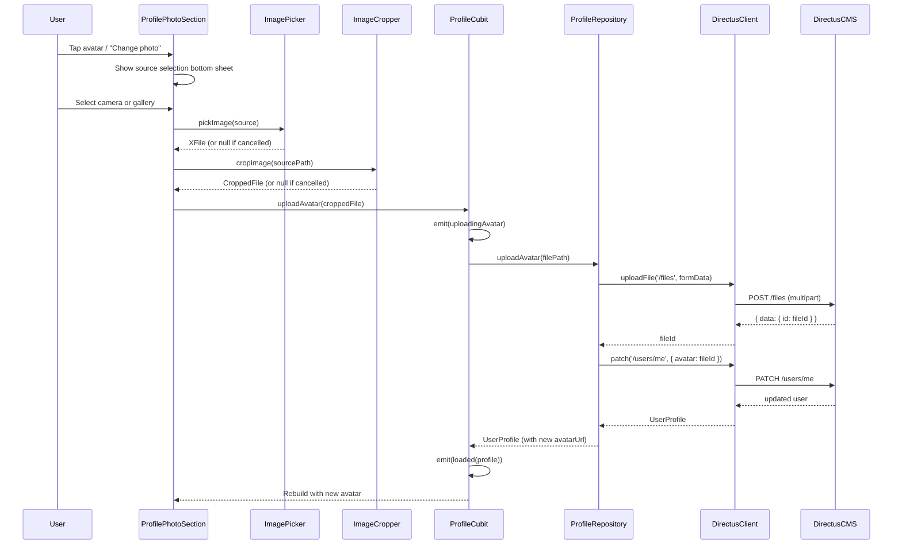

# Design Document: Profile Avatar Upload

## Overview

This feature adds avatar upload functionality to the Dancee App's Edit Profile screen. Users can pick an image from their gallery or capture one with the camera, crop it to a 1:1 square, upload it to Directus CMS via the `/files` endpoint, and link the returned file ID to their profile via `PATCH /users/me`. The avatar is displayed using the `{directusBaseUrl}/assets/{fileId}` URL pattern across the profile card and edit profile screens.

The implementation follows the existing app architecture: a repository method handles the Directus multipart upload and profile patch, the `ProfileCubit` orchestrates state transitions (including an upload-in-progress state), and the UI layer uses the existing `ProfilePhotoSection` widget enhanced with image picker, cropper integration, and loading feedback.

### Key Design Decisions

1. **image_picker + image_cropper packages**: These are the standard Flutter packages for cross-platform image selection and cropping. Both support Android, iOS, and Web.
2. **Multipart upload via Dio**: The existing `DirectusClient` uses Dio, which natively supports `FormData` and multipart uploads. We add a dedicated `uploadFile` method rather than modifying the existing `post` method.
3. **Single upload method in ProfileRepository**: The upload + link operation is combined into one repository method (`uploadAvatar`) that performs both the file upload and the `PATCH /users/me` call, keeping the cubit logic simple.
4. **New ProfileState variant**: A new `uploadingAvatar` state is added to `ProfileState` to distinguish avatar upload progress from general profile updates, enabling targeted UI feedback.

## Architecture



## Components and Interfaces

### 1. DirectusClient — New `uploadFile` Method

A new method on the existing `DirectusClient` to handle multipart file uploads. This is necessary because the existing `post` method sets `Content-Type: application/json` and expects a JSON envelope response, while file uploads require `multipart/form-data`.

```dart
/// Uploads a file via multipart/form-data and returns the unwrapped response.
Future<dynamic> uploadFile(String path, {required FormData formData}) async {
  try {
    final response = await _dio.post<Map<String, dynamic>>(
      path,
      data: formData,
      options: Options(contentType: 'multipart/form-data'),
    );
    return _unwrap(response);
  } on DioException catch (e) {
    throw _mapDioException(e);
  }
}
```

### 2. ProfileRepository — New `uploadAvatar` Method

Combines the two-step operation (upload file, then link to profile) into a single method.

```dart
/// Uploads an avatar image to Directus and links it to the current user's profile.
/// Returns the updated [UserProfile] with the new avatar URL.
Future<UserProfile> uploadAvatar(String filePath, String fileName) async {
  // Step 1: Upload file to /files
  final formData = FormData.fromMap({
    'file': await MultipartFile.fromFile(filePath, filename: fileName),
  });
  final fileData = await _client.uploadFile('/files', formData: formData);
  final fileId = (fileData as Map<String, dynamic>)['id'] as String;

  // Step 2: Link avatar to user profile
  final userData = await _client.patch('/users/me', data: {'avatar': fileId});
  return UserProfile.fromDirectus(
    userData as Map<String, dynamic>,
    directusBaseUrl: AppConfig.directusBaseUrl,
  );
}
```

### 3. ProfileCubit — New `uploadAvatar` Method

Orchestrates the avatar upload flow with proper state transitions.

```dart
/// Uploads a new avatar image and updates the profile state.
Future<void> uploadAvatar(String filePath, String fileName) async {
  final currentProfile = state.maybeMap(
    loaded: (s) => s.profile,
    orElse: () => null,
  );
  if (currentProfile == null) return;

  emit(ProfileState.uploadingAvatar(profile: currentProfile));
  try {
    final updated = await _profileRepository.uploadAvatar(filePath, fileName);
    emit(ProfileState.loaded(profile: updated));
  } catch (e) {
    emit(ProfileState.loaded(profile: currentProfile));
    rethrow; // Let the UI catch and show error snackbar
  }
}
```

### 4. ProfileState — New `uploadingAvatar` Variant

```dart
@freezed
class ProfileState with _$ProfileState {
  const factory ProfileState.initial() = _Initial;
  const factory ProfileState.loading() = _Loading;
  const factory ProfileState.loaded({required UserProfile profile}) = _Loaded;
  const factory ProfileState.updating({required UserProfile profile}) = _Updating;
  const factory ProfileState.uploadingAvatar({required UserProfile profile}) = _UploadingAvatar;
  const factory ProfileState.error({required String message}) = _Error;
}
```

### 5. ProfilePhotoSection — Enhanced Widget

The existing `ProfilePhotoSection` is enhanced to:
- Call `_showSourceSelection()` when tapped (avatar or "Change photo" text)
- Show a bottom sheet with camera/gallery options
- Launch `ImagePicker` and then `ImageCropper`
- Call `ProfileCubit.uploadAvatar()` with the cropped file
- Display a `CircularProgressIndicator` overlay during `uploadingAvatar` state
- Disable tap interactions during upload

### 6. Source Selection Bottom Sheet

A modal bottom sheet using the app's dark theme (`appSurface` background, `appBorder` dividers, `appText`/`appMuted` text colors). Options:
- Camera icon + "Take a photo" (hidden on Web if camera unavailable)
- Gallery icon + "Choose from gallery"
- Cancel option

### 7. New Packages

| Package | Version | Purpose |
|---------|---------|---------|
| `image_picker` | `^1.1.0` | Cross-platform image selection (camera/gallery) |
| `image_cropper` | `^8.0.0` | Native crop UI with 1:1 aspect ratio enforcement |

Both packages support Android, iOS, and Web.

### 8. i18n Keys

New translation keys under `profile.editProfile.avatar`:

```json
{
  "profile": {
    "editProfile": {
      "avatar": {
        "takePhoto": "Take a photo",
        "chooseFromGallery": "Choose from gallery",
        "uploadError": "Failed to upload photo. Please try again.",
        "linkError": "Failed to update profile photo. Please try again.",
        "permissionRequired": "Camera or gallery permission is required to change your photo.",
        "sourceTitle": "Change profile photo"
      }
    }
  }
}
```

These keys are added to all three language files (en, cs, es).

## Data Models

### Existing Models (No Changes)

**UserProfile** — Already has `avatarUrl` field (nullable `String?`). The `fromDirectus` factory already constructs the avatar URL from the `avatar.id` field using `{directusBaseUrl}/assets/{fileId}`. No changes needed.

### Directus File Upload Response

The `POST /files` endpoint returns a Directus envelope:

```json
{
  "data": {
    "id": "a1b2c3d4-e5f6-...",
    "storage": "s3",
    "filename_disk": "a1b2c3d4-...",
    "filename_download": "avatar.jpg",
    "title": "Avatar",
    "type": "image/jpeg",
    "uploaded_on": "2024-01-01T00:00:00Z",
    "filesize": 123456
  }
}
```

We only extract the `id` field from the unwrapped `data` object. No new entity class is needed — the file ID is a plain `String` passed directly to the `PATCH /users/me` call.

### Directus PATCH /users/me Request

```json
{ "avatar": "<fileId>" }
```

The response is the full user object, which is parsed by the existing `UserProfile.fromDirectus()`.

### State Flow

```
loaded(profile) → [user taps avatar] → uploadingAvatar(profile) → [upload + link] → loaded(updatedProfile)
                                                                  → [error] → loaded(profile) + rethrow
```


## Correctness Properties

*A property is a characteristic or behavior that should hold true across all valid executions of a system — essentially, a formal statement about what the system should do. Properties serve as the bridge between human-readable specifications and machine-verifiable correctness guarantees.*

### Property 1: Multipart uploads include authentication headers

*For any* file upload request made through `DirectusClient.uploadFile`, the request headers SHALL contain an `Authorization: Bearer <token>` header identical to those included in standard JSON requests (`get`, `post`, `patch`).

**Validates: Requirements 3.2**

### Property 2: File ID extraction from Directus upload response

*For any* valid Directus file upload response containing a `data` object with an `id` field, the `uploadAvatar` method SHALL correctly extract and return the file ID string. Specifically, for any generated file ID string, wrapping it in `{ "data": { "id": fileId, ... } }` and passing it through the response parsing logic should yield that same file ID.

**Validates: Requirements 3.3**

### Property 3: Avatar URL construction

*For any* non-null file ID string and any Directus base URL, `UserProfile.fromDirectus` SHALL construct the avatar URL as `{directusBaseUrl}/assets/{fileId}`. This is a round-trip property: uploading a file that returns `fileId`, then fetching the profile, should produce an `avatarUrl` equal to `{baseUrl}/assets/{fileId}`.

**Validates: Requirements 4.2, 6.1**

### Property 4: State recovery after upload completion

*For any* avatar upload attempt (whether it succeeds or fails), the `ProfileCubit` SHALL transition out of the `uploadingAvatar` state. On success, the final state SHALL be `loaded` with the updated profile. On failure, the final state SHALL be `loaded` with the original (unchanged) profile.

**Validates: Requirements 5.3**

### Property 5: Initials generation from user name

*For any* user name string, the initials function SHALL return: the first character of the first word and the first character of the last word (uppercased) when the name has two or more words; the first character (uppercased) when the name has one word; and `"?"` when the name is empty or whitespace-only.

**Validates: Requirements 6.2**

### Property 6: Translation completeness across languages

*For any* translation key under `profile.editProfile.avatar`, the key SHALL exist with a non-empty value in all three language files (English, Czech, Spanish).

**Validates: Requirements 7.1**

## Error Handling

### Upload Failures

| Error Scenario | Handling |
|---|---|
| File upload POST fails (network, timeout, server error) | `ProfileCubit` catches the exception, reverts to `loaded` state with original profile, rethrows so the UI shows a localized error snackbar using `t.profile.editProfile.avatar.uploadError` |
| Profile PATCH fails after successful upload | Same as above — revert state, show `t.profile.editProfile.avatar.linkError`. The orphaned file in Directus is acceptable (Directus can clean up unused files separately) |
| Image picker returns null (user cancelled) | No-op. No state change, no error message |
| Image cropper returns null (user cancelled) | No-op. No state change, no error message |
| Permission denied (camera/gallery) | Show snackbar with `t.profile.editProfile.avatar.permissionRequired` |

### Error Display Pattern

Errors follow the existing pattern used in `ProfileEditScreen._save()`:

```dart
} catch (_) {
  if (mounted) {
    ScaffoldMessenger.of(context).showSnackBar(
      SnackBar(content: Text(t.profile.editProfile.avatar.uploadError)),
    );
  }
}
```

### State Invariants

- The `uploadingAvatar` state is always transient — it must resolve to either `loaded` (success or failure)
- The `uploadingAvatar` state always carries the current profile so the UI can still display user data during upload
- No double-upload is possible because the UI disables interaction during `uploadingAvatar`

## Testing Strategy

### Property-Based Testing

**Library**: `dart_check` (or `glados` — the standard property-based testing libraries for Dart)

**Configuration**: Minimum 100 iterations per property test.

Each property test references its design document property:

| Property | Test Description |
|---|---|
| Property 1 | Generate random file paths and verify that `uploadFile` requests include the same auth header as `get`/`post`/`patch` requests |
| Property 2 | Generate random UUID strings, wrap in Directus response format, verify extracted ID matches input |
| Property 3 | Generate random (baseUrl, fileId) pairs, construct a Directus JSON response, parse via `UserProfile.fromDirectus`, verify `avatarUrl == "$baseUrl/assets/$fileId"` |
| Property 4 | Generate random profiles and simulate upload success/failure, verify final state is always `loaded` (never `uploadingAvatar`) |
| Property 5 | Generate random name strings (empty, single word, multi-word, whitespace), verify initials follow the specified rules |
| Property 6 | Enumerate all avatar translation keys, verify each exists in all three language JSON files |

Tag format: `Feature: profile-avatar-upload, Property {N}: {title}`

### Unit Tests

Unit tests cover specific examples, edge cases, and integration points:

- **Image picker cancellation**: Verify no state change when picker returns null
- **Cropper cancellation**: Verify no state change when cropper returns null
- **Successful upload flow**: Mock DirectusClient, verify uploadAvatar calls POST /files then PATCH /users/me in sequence
- **Upload failure**: Mock a DioException on POST /files, verify state reverts to loaded
- **Link failure**: Mock success on POST /files but failure on PATCH /users/me, verify state reverts
- **Permission denied handling**: Verify the UI shows the permission error message
- **Web platform camera hiding**: Verify the bottom sheet omits the camera option on web when camera is unavailable
- **Empty avatar URL fallback**: Verify ProfilePhotoSection shows initials when avatarUrl is null or empty
- **Image load error fallback**: Verify the initials fallback renders when the cached image fails to load
