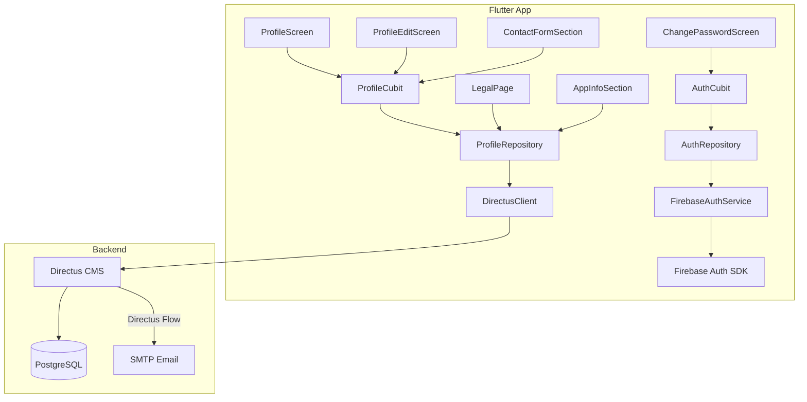
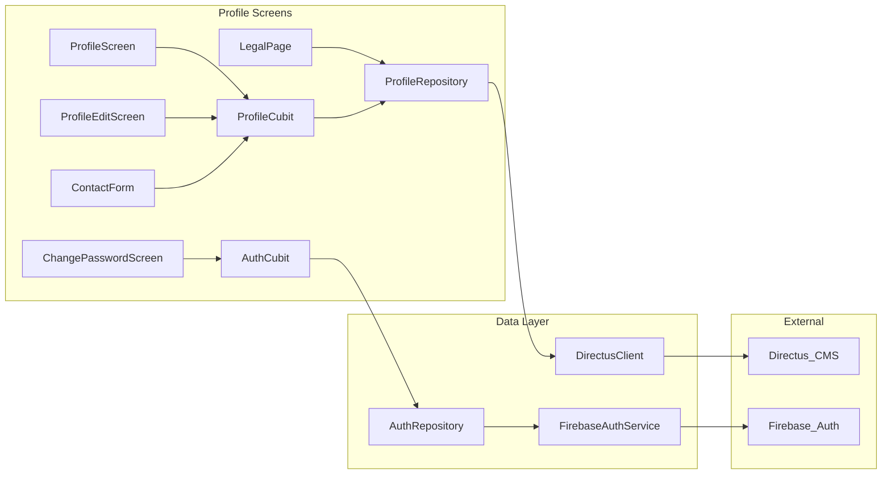

# Design Document: Profile Page Features

## Overview

This design covers the completion of the Profile Page in the dancee_app Flutter frontend, connecting currently-mocked UI to real backend data and adding missing functionality. The work spans three layers:

1. **Flutter frontend** — Replace hardcoded mock data in `ProfileRepository` with real Directus CMS API calls, add PATCH support to `DirectusClient`, implement password change via Firebase Auth, add legal content pages with Markdown rendering, wire real app/device info via platform plugins, submit contact messages to CMS, and comment out the unfinished Premium section.
2. **Directus CMS** — Create new collections (`contact_messages`, `legal_pages` with translations), configure a Directus Flow for email notifications on new contact messages.
3. **Translation compliance** — Ensure all user-facing strings across profile screens use slang translation keys (en, cs, es).

The design reuses existing patterns: `DirectusClient` for API calls, Cubit/Bloc for state management, `freezed` for state classes, repository pattern for data access, and `extractTranslation` for language fallback.

## Architecture

### High-Level Data Flow



### Component Interaction



### Key Design Decisions

1. **ProfileCubit for profile state** — A new `ProfileCubit` manages profile data loading, updating, and contact form submission. This replaces the current pattern of creating `ProfileRepository` instances directly in widgets. The cubit is registered as a lazy singleton in `service_locator.dart` and provides reactive state to all profile screens.

2. **DirectusClient.patch** — The existing `DirectusClient` lacks a PATCH method. We add one following the same pattern as `post()` and `get()` — Dio call, envelope unwrapping, error mapping.

3. **Legal content via Directus translatable collection** — Legal pages (Terms of Use, Privacy Policy) are stored as Markdown in a `legal_pages` collection with a `legal_pages_translations` junction table. Content is fetched by slug (`terms-of-use`, `privacy-policy`) and rendered with `flutter_markdown`.

4. **Password change via Firebase reauthentication** — The change password flow reauthenticates with the current password, then calls `updatePassword`. This reuses the existing `FirebaseAuthService` pattern. No "Forgot password?" link is shown on this screen.

5. **Contact messages stored in Directus** — A `contact_messages` collection stores submissions. A Directus Flow triggers on `items.create` for this collection and sends an email notification via the configured SMTP transport.

6. **No social links** — The `SocialLinksSection` is removed from the profile edit screen. The `UserData` model drops `instagram` and `facebook` fields.

7. **Platform plugins for real data** — `package_info_plus` provides app version/build number. `device_info_plus` provides device model and OS version. Both are already common Flutter plugins.

## Components and Interfaces

### 1. DirectusClient — Add PATCH Method

Add a `patch` method to `lib/core/clients.dart`:

```dart
Future<dynamic> patch(String path, {dynamic data}) async {
  try {
    final response = await _dio.patch<Map<String, dynamic>>(path, data: data);
    return _unwrap(response);
  } on DioException catch (e) {
    throw _mapDioException(e);
  }
}
```

### 2. ProfileRepository — Real Data

Replace the current mock `UserRepository` with a `ProfileRepository` class that takes `DirectusClient` as a dependency and makes real API calls.

**Interface:**

```dart
class ProfileRepository {
  ProfileRepository({required DirectusClient client});

  /// Fetches the Directus user profile for the given Firebase UID.
  /// Queries /users with filter on firebase_uid external field.
  Future<UserProfile> getUserProfile(String firebaseUid);

  /// Updates user profile fields via PATCH /users/{directusUserId}.
  Future<UserProfile> updateUserProfile(String directusUserId, Map<String, dynamic> fields);

  /// Fetches legal page content by slug and language code.
  /// Queries /items/legal_pages with translations.
  Future<String> getLegalContent(String slug, String languageCode);

  /// Submits a contact message to /items/contact_messages.
  Future<void> submitContactMessage(ContactMessage message);

  /// Returns app version string from package_info_plus.
  Future<String> getAppVersion();

  /// Returns device info from package_info_plus + device_info_plus.
  Future<DeviceInfoData> getDeviceInfo();
}
```

### 3. ProfileCubit — Profile State Management

New cubit at `lib/logic/cubits/profile_cubit.dart` with state at `lib/logic/states/profile_state.dart`.

**State (freezed):**

```dart
@freezed
class ProfileState with _$ProfileState {
  const factory ProfileState.initial() = _Initial;
  const factory ProfileState.loading() = _Loading;
  const factory ProfileState.loaded({required UserProfile profile}) = _Loaded;
  const factory ProfileState.updating() = _Updating;
  const factory ProfileState.error({required String message}) = _Error;
}
```

**Cubit methods:**
- `loadProfile()` — Fetches profile using Firebase UID from `AuthCubit`
- `updateProfile(Map<String, dynamic> fields)` — PATCHes profile, re-emits loaded state
- `submitContactMessage(ContactMessage message)` — POSTs to contact_messages

### 4. UserProfile Model

New entity at `lib/data/entities/user_profile.dart`:

```dart
class UserProfile extends Equatable {
  final String directusUserId;
  final String firebaseUid;
  final String firstName;
  final String lastName;
  final String email;
  final String? phone;
  final String? city;
  final String? bio;
  final String? avatarUrl;
  final List<String> danceTags;
  final String? experienceLevel;

  String get fullName => '$firstName $lastName'.trim();

  factory UserProfile.fromDirectus(Map<String, dynamic> json, {required String directusBaseUrl});
}
```

### 5. ContactMessage Model

```dart
class ContactMessage {
  final String type;
  final String title;
  final String body;
  final String replyEmail;
  final String? phone;
  final String appVersion;
  final String deviceModel;
  final String osVersion;
  final String firebaseUid;

  Map<String, dynamic> toDirectus() => {
    'type': type,
    'title': title,
    'message': body,
    'reply_email': replyEmail,
    'phone': phone,
    'device_info': {
      'app_version': appVersion,
      'device_model': deviceModel,
      'os_version': osVersion,
      'firebase_uid': firebaseUid,
    },
  };
}
```

### 6. LegalPage Screen

New screen at `lib/screens/profile/legal/legal_page_screen.dart`. Takes a `slug` parameter (`terms-of-use` or `privacy-policy`) and a `title` string. Fetches Markdown content from `ProfileRepository.getLegalContent()` and renders it with `flutter_markdown`'s `MarkdownBody` widget.

A new route `LegalPageRoute` is added to `app_routes.dart`:

```dart
@TypedGoRoute<LegalPageRoute>(path: '/profile/legal')
class LegalPageRoute extends GoRouteData {
  const LegalPageRoute({required this.slug, required this.title});
  final String slug;
  final String title;
}
```

### 7. ChangePasswordScreen — Firebase Integration

The existing `PasswordFormSection` is updated to:
1. Accept callbacks for actual password change logic
2. Remove the `ForgotPasswordLink` widget
3. Remove the special character requirement from `PasswordRequirementsSection`
4. Wire the save button to `FirebaseAuthService` via `AuthRepository`:
   - Reauthenticate with current password
   - Call `user.updatePassword(newPassword)`
5. Show loading state and success/error feedback

A new method is added to `FirebaseAuthService`:

```dart
Future<void> changePassword({
  required String currentPassword,
  required String newPassword,
}) async {
  final user = _auth.currentUser;
  if (user == null || user.email == null) throw 'auth.errors.generic';
  final credential = EmailAuthProvider.credential(email: user.email!, password: currentPassword);
  await user.reauthenticateWithCredential(credential);
  await user.updatePassword(newPassword);
}
```

And exposed through `AuthRepository` and `AuthCubit`.

### 8. ProfileScreen — Premium Section Commented Out

The `PremiumBanner` widget reference and its `SectionLabel` in `profile_screen.dart` are commented out. The widget files remain untouched.

### 9. AppInfoSection — Real Version + Legal Navigation

- Version display uses `package_info_plus` via `ProfileRepository.getAppVersion()`
- Terms of Use and Privacy Policy menu items navigate to `LegalPageRoute`

## Data Models

### Directus Collections

#### `legal_pages` Collection

| Field | Type | Notes |
|-------|------|-------|
| id | integer (auto PK) | Standard Directus PK |
| slug | string (unique) | `terms-of-use`, `privacy-policy` |
| status | string | `published` / `draft` |
| translations | alias (O2M) | Links to `legal_pages_translations` |

#### `legal_pages_translations` Collection

| Field | Type | Notes |
|-------|------|-------|
| id | integer (auto PK) | Standard Directus PK |
| legal_pages_id | integer (FK) | References `legal_pages.id` |
| languages_code | string (FK) | References `languages.code` (en, cs, es) |
| title | string | Localized page title |
| content | text | Markdown content, using Directus Markdown editor interface |

#### `contact_messages` Collection

| Field | Type | Notes |
|-------|------|-------|
| id | integer (auto PK) | Standard Directus PK |
| type | string (enum) | Message type enum: `bug`, `feature`, `feedback`, `other` |
| title | string | Message title |
| message | text | Message body |
| reply_email | string | Sender's reply email |
| phone | string (nullable) | Sender's phone |
| device_info | json | JSON object: `{app_version, device_model, os_version, firebase_uid}` |
| date_created | timestamp | Auto-set by Directus |

#### Directus User Profile Fields (existing `directus_users` extension)

The Directus Firebase Auth extension creates users in `directus_users`. We extend the user record with custom fields:

| Field | Type | Notes |
|-------|------|-------|
| firebase_uid | string | Set by Firebase auth extension |
| first_name | string | Directus built-in |
| last_name | string | Directus built-in |
| email | string | Directus built-in |
| phone | string (nullable) | Custom field |
| city | string (nullable) | Custom field |
| bio | text (nullable) | Custom field |
| avatar | uuid (nullable) | Directus file reference |
| dance_tags | json (nullable) | Array of dance style codes |
| experience_level | string (nullable) | Beginner, Intermediate, Advanced, Expert |

### Directus Flow: Contact Message Email Notification

- **Trigger**: `items.create` on `contact_messages` collection
- **Action**: Send email via configured SMTP transport
- **To**: Configured author email address (stored in Directus Flow configuration)
- **Subject**: `[Dancee Contact] {{$trigger.payload.type}}: {{$trigger.payload.title}}`
- **Body**: Includes message body, reply email, timestamp, device info

### Flutter Data Models

#### UserProfile (replaces UserData)

```dart
class UserProfile extends Equatable {
  final String directusUserId;
  final String firebaseUid;
  final String firstName;
  final String lastName;
  final String email;
  final String? phone;
  final String? city;
  final String? bio;
  final String? avatarUrl;
  final List<String> danceTags;
  final String? experienceLevel;

  String get fullName => '$firstName $lastName'.trim();
}
```

#### ContactMessage

```dart
class ContactMessage {
  final String type;
  final String title;
  final String body;
  final String replyEmail;
  final String? phone;
  final DeviceInfoData deviceInfo;
  final String firebaseUid;
}
```

#### DeviceInfoData (unchanged structure, real implementation)

```dart
class DeviceInfoData {
  final String appVersion;
  final String device;
  final String os;
}
```

### New Flutter Dependencies

| Package | Purpose |
|---------|---------|
| `package_info_plus` | Real app version and build number |
| `device_info_plus` | Device model and OS version |
| `flutter_markdown` | Render Markdown content for legal pages |


## Correctness Properties

*A property is a characteristic or behavior that should hold true across all valid executions of a system — essentially, a formal statement about what the system should do. Properties serve as the bridge between human-readable specifications and machine-verifiable correctness guarantees.*

### Property 1: UserProfile serialization round-trip

*For any* valid `UserProfile` instance, converting it to a Directus-compatible map via `toDirectus()` and then parsing that map back via `UserProfile.fromDirectus()` should produce an equivalent `UserProfile` (same field values for all non-computed fields).

**Validates: Requirements 1.1, 2.1**

### Property 2: Password validation correctness

*For any* string, the password validation function should return valid if and only if the string has length >= 8, contains at least one uppercase letter, contains at least one lowercase letter, and contains at least one digit. Special characters are not required and should not affect the result.

**Validates: Requirements 3.4**

### Property 3: Translation extraction language fallback

*For any* non-empty list of translation objects (each with a `languages_code` field) and any target language code, `extractTranslation` should: (a) return the exact language match if present, (b) fall back to English (`en`) if the target language is absent, (c) fall back to the first available translation if neither the target nor English is present.

**Validates: Requirements 4.3**

### Property 4: ContactMessage serialization completeness

*For any* `ContactMessage` instance with all fields populated, `toDirectus()` should produce a map containing the required keys: `type`, `title`, `message`, `reply_email`, `phone`, and `device_info` (a JSON object with `app_version`, `device_model`, `os_version`, `firebase_uid`), with values matching the original instance fields.

**Validates: Requirements 7.1, 7.2**

### Property 5: Contact form required field validation

*For any* contact form input where at least one required field (type, title, message, reply email) is empty or whitespace-only, validation should reject the submission. *For any* contact form input where all required fields are non-empty and non-whitespace, validation should accept the submission.

**Validates: Requirements 7.6**

## Error Handling

### Network Errors (DirectusClient)

All Directus API calls go through `DirectusClient`, which already maps `DioException` types to `ApiException` with translation keys. This pattern is reused for all new endpoints (profile fetch, profile update, legal content fetch, contact message submission).

| Error | Handling |
|-------|----------|
| Connection timeout | `ApiException` with `api.errors.connectionTimeout` key |
| 401 Unauthorized | `ApiException` with `api.errors.unauthorized` — triggers re-auth flow |
| 403 Forbidden | `ApiException` with `api.errors.forbidden` |
| 404 Not Found | `ApiException` with `api.errors.notFound` — shown as "content not available" for legal pages |
| 500+ Server Error | `ApiException` with appropriate server error key |
| Network unavailable | `ApiException` with `api.errors.noConnection` |

### Firebase Auth Errors (Password Change)

| Error | Handling |
|-------|----------|
| `invalid-credential` | Display "incorrect current password" message via translation key |
| `weak-password` | Display "password too weak" message (should be caught by client-side validation first) |
| `too-many-requests` | Display "too many attempts" message |
| `requires-recent-login` | Reauthentication failed — prompt user to try again |
| Network error | Display generic network error message |

### Contact Form Submission

- Client-side validation runs before any network call
- On submission failure, the form retains all entered data and shows an error banner
- The send button returns to its default state so the user can retry
- Success state auto-resets after a brief delay

### Legal Page Content

- Loading state shows a centered `CircularProgressIndicator`
- Error state shows an error message with a retry button
- If content is empty (published but no translation for current language), falls back through the translation chain (target → en → first available)

## Testing Strategy

### Unit Tests

Unit tests cover specific examples, edge cases, and error conditions:

- **UserProfile.fromDirectus** — Parse a known Directus user JSON and verify all fields
- **UserProfile.fromDirectus with missing optional fields** — Verify nullable fields default correctly
- **ContactMessage.toDirectus** — Verify a known message produces the expected map
- **Password validation edge cases** — Empty string, exactly 8 chars meeting all criteria, string with only uppercase, string with only digits
- **Contact form validation edge cases** — All fields empty, only type empty, whitespace-only title
- **Legal content fetch with empty translations array** — Returns null/empty gracefully
- **No social links in ProfileEditScreen** — Widget test verifying SocialLinksSection is absent
- **No ForgotPasswordLink in ChangePasswordScreen** — Widget test verifying the link is absent
- **Premium section commented out** — Widget test verifying PremiumBanner is absent from ProfileScreen

### Property-Based Tests

Property-based tests verify universal properties across randomly generated inputs. Each property test references its design document property and runs a minimum of 100 iterations.

**Library**: `fast_check` (Dart property-based testing library) or equivalent. If no mature Dart PBT library is available, use `test` package with custom random generators producing at least 100 iterations per property.

**Tests**:

1. **Feature: profile-page-features, Property 1: UserProfile serialization round-trip**
   - Generate random UserProfile instances with varied field combinations
   - Serialize via `toDirectus()`, deserialize via `fromDirectus()`
   - Assert equivalence of all non-computed fields

2. **Feature: profile-page-features, Property 2: Password validation correctness**
   - Generate random strings of varying length and character composition
   - Assert validation result matches the conjunction of: length >= 8, has uppercase, has lowercase, has digit

3. **Feature: profile-page-features, Property 3: Translation extraction language fallback**
   - Generate random lists of translation objects with random language codes
   - Assert the fallback chain: exact match → English → first available

4. **Feature: profile-page-features, Property 4: ContactMessage serialization completeness**
   - Generate random ContactMessage instances with all fields populated
   - Assert `toDirectus()` output contains all required keys with matching values

5. **Feature: profile-page-features, Property 5: Contact form required field validation**
   - Generate random form inputs with some required fields randomly set to empty/whitespace
   - Assert validation rejects when any required field is empty, accepts when all are non-empty
